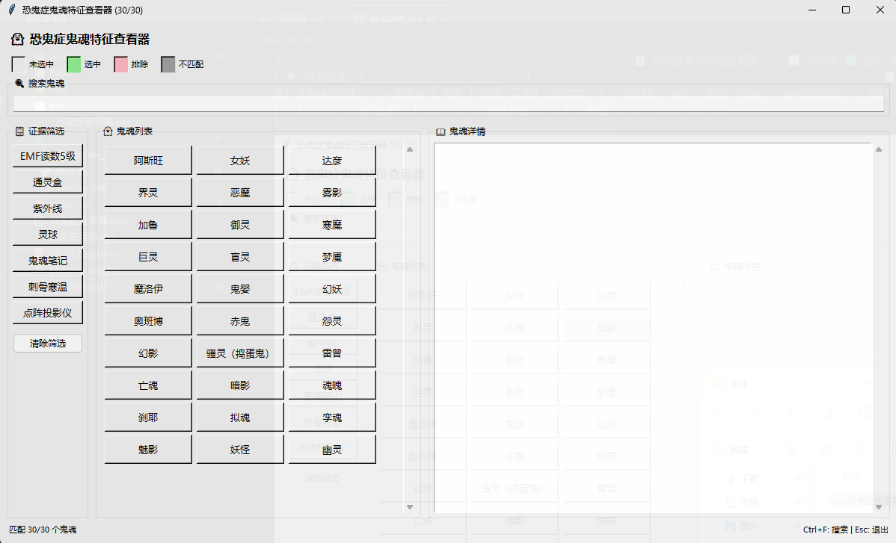

# 恐鬼症鬼魂特征查看器

一个轻量级悬浮窗工具，让你在《恐鬼症》(Phasmophobia) 游戏中快速查看鬼魂特征，无需频繁翻书。

## 🚀 快速开始（开箱即用）

**下载即用，无需安装任何依赖：**

1. 从 [Releases](../../releases) 页面下载最新版本的 恐鬼症查看器.exe
2. 双击运行即可
3. 悬浮窗会自动置顶显示在游戏窗口上方

> 💡 **提示**：程序启动后会显示在屏幕，你可以拖动移动位置。

## ✅ 功能特点

- ⭐ **始终置顶**：悬浮窗始终显示在游戏窗口上方
- 🔎 **快速搜索**：支持按鬼魂名称实时搜索
- 📋 **证据筛选**：可按证据类型筛选鬼魂
- 📖 **详细信息**：显示鬼魂的危险等级、速度、特征、能力等
- 🪶 **轻量级**：单文件程序，体积小，启动快

## 🎯 横向三栏布局

程序采用横向三栏布局，信息一目了然：

`
┌─────────────────────────────────────────────────────────┐
│  👻 恐鬼症鬼魂特征查看器                                  │
│  ⬜ 未选中  🟩 选中  🟪 排除  ⬛ 不匹配                  │
├─────────────────────────────────────────────────────────┤
│  🔍 搜索鬼魂: [________________________]                │
├────────────┬───────────────────┬────────────────────────┤
│ 📋 证据筛选  │   👻 鬼魂列表      │  📖 鬼魂详情            │
│            │                   │                        │
│ +EMF读数5级 │ 阿斯旺 │ 女妖 │达彦│  【鬼魂名称】           │
│ +通灵盒     │ 界灵  │ 恶魔 │雾影│  证据类型:              │
│  紫外线    │ 加鲁  │ 御灵 │寒魔│    • EMF读数5级         │
│  灵球      │ 巨灵  │ 盲灵 │梦魇│    • 通灵盒             │
│  鬼魂笔记   │ ...   │ ...  │... │  描述:                 │
│  刺骨寒温   │       │      │    │  ...                   │
│  点阵投影仪  │       │      │    │                        │
│ [清除筛选]  │       │      │    │  特征:                  │
│            │       │      │    │  ...                   │
├────────────┴───────────────────┴────────────────────────┤
│  匹配 30/30 个鬼魂              Ctrl+F:搜索 | Esc:退出  │
└─────────────────────────────────────────────────────────┘
`


## 🎨 背景色说明

按钮背景色表示不同状态：

| 颜色 | 状态 | 说明 |
|------|------|------|
| ⬜ 灰色 #f0f0f0 | 未选中 | 默认状态 |
| 🟩 绿色 #90EE90 | 选中 | 确认的鬼魂或包含的证据 |
| 🟪 粉色 #FFB6C1 | 排除 | 排除的鬼魂或排除的证据 |
| ⬛ 深灰 #a0a0a0 | 不匹配 | 与当前筛选条件不匹配 |

### 使用方法

1. **点击证据按钮**：切换包含(绿)/排除(粉)/未选(灰)状态
2. **点击鬼魂按钮**：切换选中(绿)/排除(粉)/未选(灰)状态
3. **不匹配的鬼魂**：自动变暗禁用，无法点击

## ⌨️ 快捷键

| 快捷键 | 功能 |
|--------|------|
| Ctrl + F | 聚焦到搜索框 |
| Esc | 缩小为悬浮窗 |

## 📖 使用说明

### 搜索功能
在搜索框中输入鬼魂名称即可实时筛选列表。

### 证据筛选
- **点击一次**（绿色）：必须包含此证据
- **点击两次**（粉色）：排除此证据
- **点击三次**：恢复未选状态
- 点击"清除筛选"按钮可以重置所有筛选条件

### 鬼魂详情
点击列表中的鬼魂名称即可查看详细信息：
- 证据类型
- 描述
- 特殊特征和能力
- 弱点和缺点

## 🛠️ 自定义配置

可以编辑 data/config.json 文件来自定义：

`json
{
  "window": {
    "width": 1200,
    "height": 700,
    "opacity": 0.95,
    "always_on_top": true
  }
}
`

## ❓ 常见问题

### 程序无法启动
- 确保下载的是完整的 exe 文件
- 检查杀毒软件是否拦截了程序
- 尝试以管理员身份运行

### 数据显示不正确
- 确保 data/ghosts_data_cn.json 文件存在且完整
- 检查文件编码是否为 UTF-8

### 窗口被游戏遮挡
- 程序默认设置为置顶显示
- 如果仍然被遮挡，尝试以管理员身份运行程序

## 📁 项目结构

`
phasmophobiaWatcher/
├── dist/
│   └── 恐鬼症查看器.exe       # 可执行程序（推荐使用）
├── src/
│   └── main.py               # Python 源码
├── data/
│   ├── config.json           # 配置文件
│   └── ghosts_data_cn.json   # 鬼魂数据（中文）
├── 启动查看器.vbs             # VBS 启动脚本（需要 Python 环境）
└── README.md
`

## 🔄 其他启动方式

### 方式二：使用 VBS 脚本（需要 Python 环境）
如果你已安装 Python，可以双击 启动查看器.vbs 启动，这个方式不会显示命令行窗口。

### 方式三：直接运行 Python 脚本
```bash
python src/main.py
```

## 📊 数据来源

鬼魂数据来源于社区维护的《恐鬼症》数据库，包含所有30种鬼魂的详细特征信息。

## 📝 更新日志

### v2.0
- 全新横向三栏布局
- 证据三态筛选（包含/排除/未选）
- 鬼魂三态选择功能
- 背景色状态指示
- 优化搜索和筛选功能
- 添加快捷键支持
- 优化详情显示格式

### v1.0
- 初始版本
- 基本搜索和筛选功能
- 鬼魂详情显示

## 📜 许可证

本工具为开源项目，仅供学习和个人使用。

## 🙏 致谢

- 感谢《恐鬼症》社区提供的鬼魂数据
- 感谢所有贡献者和测试人员

---

**享受游戏，祝你猎鬼愉快！👻**